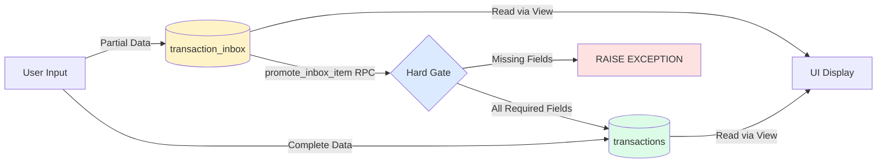

# AI ARCHITECTURE CONTEXT

## 📜 Document Governance

**Purpose**: The "Mental Model" for the codebase. High-level architecture, directory structure, and coding standards.

**Include**: Tech stack, folder organization, abstract architectural patterns (e.g., Sacred Ledger), and "Do/Don't" rules.

**Do NOT Include**: SQL definitions, table schemas, migration logs, specific file line numbers, or UI pixel measurements.

**Maintenance**: Update only when a global architectural pattern or a major tech-stack component changes.

---

## 1. Project Overview
**Name:** Finance Tracker Web
**Description:** A personal finance application for tracking income, expenses, and budgeting.
**Core Philosophy:** Strict separation between "Database Types" (snake_case) and "Domain Types" (camelCase). The frontend should never see raw database rows.

## 2. Tech Stack & Rendering Strategy
* **Framework:** Next.js 16 (App Router)
* **Rendering Strategy:** Client-Side Heavy (SPA-like architecture)
    * **CRITICAL:** This is NOT a traditional Next.js SSR app
    * All data fetching uses **Supabase Client SDK** from browser
    * Components are primarily Client Components (`"use client"`)
    * **DO NOT** suggest Server Actions or Server Components for data mutations
    * **DO NOT** suggest moving API logic to `app/api/` routes
    * Think of this as a React SPA hosted on Next.js infrastructure
* **Language:** TypeScript (Strict mode)
* **Database & Auth:** Supabase (PostgreSQL)
* **State Management (Server):** TanStack Query (React Query) v5
* **State Management (Client):** Zustand
* **Styling:** Tailwind CSS + Radix UI Primitives + Lucide Icons
* **Forms:** React Hook Form + Zod validation
* **Date Handling:** date-fns

## 3. Directory Structure (Feature-Based)
We use a **Feature-Based Architecture**. Do not group files by type; group them by feature.

```text
/app                 -> Next.js App Router (Pages & Layouts only)
/components          -> Shared UI components (Buttons, Modals, etc.)
  /ui                -> Shadcn/Radix primitive wrappers
  /shared            -> Reusable composite patterns (FormModal, DeleteDialog) - USE THESE FIRST.
/lib                 -> Global utilities & configurations
  /supabase          -> Supabase clients (Client & Server)
  /constants         -> App-wide constants (validation, ui, etc.)
/features            -> DOMAIN LOGIC (The core of the app)
  /accounts          -> Bank accounts & balance management
  /auth              -> Authentication & User Profile
  /categories        -> Expense/Income categories management
  /currencies        -> Global currency data & logic
  /dashboard         -> Overview & financial summary widgets
  /groupings         -> Custom groupings for categories
  /import-export     -> CSV/Data migration services
  /inbox             -> Staging area for draft transactions & processing logic
  /settings          -> User preferences (Theme, Main Currency)
  /shared            -> Shared UI components used across features
    /components
      /transaction-detail-panel -> Unified detail panel for Inbox + Transactions
  /transactions      -> Transaction creation, listing, and transfers
/types               -> Global type definitions
  database.types.ts  -> Raw Supabase types (Generated)
  domain.ts          -> Frontend interfaces (CamelCase)
/hooks               -> Shared/Global hooks (e.g., use-formatted-balance.ts)
/stores              -> Global Client State (Zustand stores, e.g., auth-store.ts)
/providers           -> React Context Providers (QueryProvider, AuthProvider)
/contexts            -> React Context definitions (State logic)
```

## 4. Architectural Rules (Strict Enforced)

### A. Currency Architecture (Flat Model)
* **One Currency Per Account:** Each `bank_accounts` row has exactly ONE `currency_code` that cannot be changed after creation.
* **Multi-Currency Accounts:** To support multiple currencies for the same "account concept," use the `group_id` pattern:
    * Create separate account rows for each currency (e.g., "Savings (USD)", "Savings (EUR)")
    * Link them with the same `group_id`
    * Use `create_account_group` RPC to create grouped accounts
* **No Junction Tables:** All currency logic lives on the `bank_accounts` table directly.
* **Opening Balances:** Created as transactions with `category_id = NULL` AND `transfer_id = NULL`, using the description "Opening Balance".
    * Users should set opening balances during account creation.
* **Currency Changes:** To change an account's currency, users must create a new account. The Edit Account modal only allows editing name and color, displaying currency as read-only.
* **Currency Inheritance (Normalized Architecture):**
    * **CRITICAL:** Currency is NOT an editable field in transaction forms, inbox detail panel, or transaction detail panels
    * Currency is **derived** from the selected bank account (one currency per account)
    * **Zero Redundancy Pattern:**
        * `transactions` table has NO `currency_original` column
        * `transaction_inbox` table has NO `currency_original` column
        * Currency is ALWAYS derived from `bank_accounts.currency_code` via JOIN
        * Query `transactions_view` or `transaction_inbox_view` to access currency (exposed as `currency_original` alias)
        * This makes currency desync **structurally impossible** (no redundant storage)
    * **Frontend Contract:** Code MUST NOT send `currency_original` - it doesn't exist in either table
    * **Data Flow:**
        * Transactions: `transactions.account_id → bank_accounts.currency_code`
        * Inbox: `transaction_inbox.account_id → bank_accounts.currency_code` (LEFT JOIN)
        * When `account_id` is NULL (inbox draft without account), `currency_original` is NULL
        * `promote_inbox_item` RPC requires `account_id` before promotion (hard-gate validation)
    * When user changes the account selection, the currency automatically updates to match the new account's currency
    * UI should display currency as read-only text, never as an input or selector
    * This applies to: Transaction forms, Inbox detail panel, Transaction detail panel, and all editing interfaces
* **Account Display Convention (UI Naming Pattern):**
    * **CRITICAL:** All account selectors MUST follow the format: `${Name} ${Code}`
    * **ALWAYS use `currencyCode`** (e.g., "USD", "EUR", "PEN") - NEVER use `currencySymbol` (e.g., "$", "€", "S/")
    * **Example:** "BCP Credito PEN" ✅ NOT "BCP Credito S/" ❌
    * **Type Safety:** `SelectableAccount` interfaces must include `currencyCode: string` as a required field
* **Account Name Normalization:**
    * **Rule:** Account names are stored clean in the database (no currency code suffixes)
    * **Database State:** Names like `"BCP Credito"` with `currency_code = "PEN"` (single source of truth)
    * **Uniqueness:** Database enforces `UNIQUE (user_id, name, currency_code)` to prevent duplicates
    * **DO NOT:** Add frontend code that strips currency codes from names - database is already clean!
    * **DO:** Use `account.name` directly from database without any transformation

### A2. Category Architecture ("Invisible Grouping" Pattern)
* **Strict Hierarchy, Flat UI:** Categories follow a two-level parent-child hierarchy in the database, but the UI presents only leaf nodes.
* **Groupings are Configuration, Not Destinations:**
    * Parent categories (groupings) define organizational structure, type (income/expense), and color
    * Users can ONLY select child categories (leaf nodes)
    * Parent categories are never displayed as selectable options in the UI
    * Exception: Orphaned parents (parents with no children) are treated as leaf nodes
* **Type Inheritance (Database-Enforced):**
    * Database triggers ensure children automatically inherit the parent's `type` field
    * Trigger: `sync_category_type_hierarchy` cascades type changes from parent to children
* **Color Inheritance (Database-Enforced):**
    * Triggers: `cascade_color_to_children` and `sync_child_category_color` ensure children inherit parent colors
* **Transaction Type Auto-Derivation:**
    * Users do NOT manually select transaction type (Income/Expense)
    * Transaction type is automatically derived from the selected category's type by the database
    * Database exposes `category_type` via `transactions_view` JOIN with categories table
    * Frontend displays visual feedback: Amount displays in green (income) or red (expense) by looking up `selectedCategory.type` directly
    * No derived state needed - direct category lookup from loaded categories array
* **Category Selector UI:**
    * Flat single-level list (no section headers)
    * Color indicators are the primary visual differentiator
    * No parent context shown (clean, minimal design)
    * Sorted: Income categories first, then Expense, then alphabetically
    * Hook: `useLeafCategories()` filters and returns only selectable categories
* **Implementation:**
    * **CRITICAL:** All category selectors MUST use `useLeafCategories()` - NEVER `useCategories()` directly for user selection
    * **Pattern:** Filter at the data source (hook level), not in the UI component (transformation level)

### B. Data Transformation Strategy (CRITICAL)

#### B1. Core Transformation Pattern
* **Never return raw DB rows to components.**
* **API Layer Responsibility:** Fetch data from Supabase → Transform snake_case to camelCase → Return Domain Type.
* **Transformer Pattern:** Use helper functions in `@/lib/data/data-transformers`.
    * *Bad:* `return data` (frontend receives `user_id`)
    * *Good:* `return dbTransactionToDomain(data)` (frontend receives `userId`)

#### B2. Table vs View Transformers
* **Table Transformers:** For raw table rows (e.g., `dbTransactionToDomain`, `dbInboxItemToDomain`)
    * Sets `currencyOriginal: undefined` because currency column doesn't exist in tables
    * Use ONLY for internal operations, never for UI display
* **View Transformers:** For database views (e.g., `dbTransactionViewToDomain`, `dbInboxItemViewToDomain`)
    * Includes `currencyOriginal` from view's aliased JOIN (`bank_accounts.currency_code AS currency_original`)
    * Includes joined display fields (account name, category name, colors)
    * Use for ALL UI operations and frontend display
* **Critical Rule:** Mutations must never trust raw table data - always re-fetch from views

#### B3. Write-then-Read Pattern (Mutation Architecture)
* **Rule:** Mutations must use "Write-then-Read" pattern to prevent incomplete data in React Query cache.
* **Pattern:**
    ```typescript
    // ✅ CORRECT: Write to table, then read from view
    const { data } = await supabase.from('transactions').insert({...}).select().single();
    return transactionsApi.getById(data.id); // Returns complete view data with currency
    ```
* **Applied To:** All mutation operations (`create`, `update`, `updateBatch`)

#### B4. Null/Undefined Normalization
* **The Problem:** Database uses `null` for missing values, but TypeScript optional properties use `undefined`. Mixing both creates type confusion.
* **The Solution:** Centralized bidirectional conversion in the data transformer layer:
    * **Database → Domain:** `dbInboxItemToDomain()` converts `null → undefined` for all optional fields
    * **Domain → Database:** `domainInboxItemToDbInsert()` converts `undefined → null` for database storage
* **Domain Types Use Optional Properties:**
    * **Good:** `interface InboxItem { amount?: number }` (single type: `number | undefined`)
    * **Bad:** `interface InboxItem { amount: number | null }` (dual types: confusing!)
    * **Exception:** Update params use explicit null unions (`amount?: number | null`) to differentiate "not provided" (undefined) vs "clear value" (null)
* **Benefits:**
    * Components only see `undefined`, never `null`
    * Single source of truth for conversion logic
    * Type safety without dual null/undefined checks
* **Implementation:**
    * Transformer: `lib/data/data-transformers.ts`
    * Domain Types: `features/inbox/types.ts`, `features/shared/components/transaction-detail-panel/types.ts`
    * API Layer: Uses transformer for all database operations

### C. State Management
* **Server State:** Use `useQuery` / `useMutation` hooks located in `features/[feature]/hooks/`.
* **Pagination:** All list queries use `useInfiniteQuery` with offset-based pagination.
    * **Page Size:** 50 items per page (configured in `PAGINATION.DEFAULT_PAGE_SIZE`)
    * **Virtualization:** Lists render only visible items (~15) using `@tanstack/react-virtual`
    * **Pattern:** API returns `{ data, count }`, hooks flatten pages internally for UI consumption
    * **Server-Side Aggregation:** Category counts use separate lightweight queries (not client-side counting)
* **Optimistic Updates (Zero-Latency UX):**
    * **Architecture:** Optimistic-Sync pattern for all transaction mutations (instant UI, background sync)
    * **Version Control:** Database-enforced optimistic concurrency via `version` column (auto-increment trigger)
    * **Mutation Pattern:**
        * `onMutate`: Cancel queries → Snapshot state → Optimistic update → Calculate balance deltas
        * `onError`: Rollback snapshots → Show conflict toast
        * `onSettled`: Always invalidate to sync with server truth
    * **Conflict Resolution:** Silent auto-retry (max 2 attempts), toast only after exhaustion
    * **Balance Calculations:** Use centralized utility (`lib/utils/balance-logic.ts`) with cents arithmetic
    * **Cache Updates:** Use `setQueriesData()` (plural) to update ALL filter views simultaneously
    * **Client UUIDs:** Generate IDs with `crypto.randomUUID()` for instant feedback with real IDs
    * **React Query Config:** `staleTime: 10min` (prevents background refetch flicker), retry with exponential backoff
* **Invalidation:** Mutations must invalidate relevant query keys upon success.
    * *Example:* Creating a transaction must invalidate `['transactions']` AND `['accounts']` (since balances change).
* **Division of Labor:**
    * **Server State (Async):** MUST use TanStack Query (e.g., transactions, balances).
    * **Client State (Sync):** Use Zustand (e.g., user session, sidebar state, complex form wizards).

### D. API Layer Pattern
* **All Supabase logic** belongs in `features/[feature]/api/[feature].ts`.
* **Do not** call `supabase.from(...)` directly inside React components.
* **Do not** put business logic inside the API layer; keep it in Services or Hooks if complex.
* **Prefer RPC for Complex Logic:** Before writing complex transaction logic, check `database.types.ts` for existing Postgres functions.
    * *Example 1:* Use `rpc('create_transfer')` instead of manually inserting two transactions and updating balances.
    * *Example 2:* Use `rpc('promote_inbox_item')` to atomically validate and move drafts from Inbox to Ledger.
* **Execution Context:** The files in `features/*/api/*.ts` use the **Supabase Client SDK** (`@/lib/supabase/client`).
    * **DO NOT** create Next.js API Routes (`app/api/...`) or Server Actions unless strictly necessary (e.g., for webhooks).
    * **DO** call these API functions directly from your React Query hooks.

### E. Styling & UI Components
* Use `tailwind-merge` and `clsx` (via the `cn` helper) for dynamic classes.
* Prioritize Radix UI primitives for interactive elements (Dialogs, Popovers).
* **UI Component Hierarchy:**
    * **Before** using raw Radix primitives, check `@/components/shared` for pre-built patterns
    * **Always** use `FormModal` for data entry and `DeleteDialog` for confirmations
    * **Consistency:** Use established component patterns (Tag, Card, Badge) instead of custom implementations

### F. Data Entry Strategy (The "Scratchpad" Pattern)



* **The "Clean Ledger" Rule:** `transactions` table ONLY accepts complete data (Amount + Date + Account + Category).
* **The "Scratchpad Inbox" Rule:** `transaction_inbox` accepts PARTIAL data (nullable columns: `amount_original`, `description`, `notes`).
* **Smart Routing:**
    * **Complete Data** → Write to `transactions`
    * **Partial Data** → Write to `transaction_inbox`
* **Promotion Flow:**
    * Use `promote_inbox_item` RPC to move Inbox → Ledger
    * **Hard-Gate Validation:** RPC validates ALL required fields (`account_id`, `category_id`, `amount_original`, `description`, `date`)
    * **Audit Trail:** Promotion marks items as `status='processed'` and stores `inbox_id` in ledger
    * **Auto-Promotion:** Detail panel automatically promotes when all fields complete
* **Schema Parity:** Both tables use `amount_original`, support `notes` field, ledger includes `inbox_id` foreign key

### G. Transaction Detail Panel (Unified Component)
* **Path:** `features/shared/components/transaction-detail-panel/`
* **Modes:** Accepts `mode="inbox"` (Drafts) or `mode="transaction"` (Ledger)
* **Logic:**
    * **Smart Save:** Analyzes `calculateLedgerReadiness()` function
        * *Inbox Mode:* Allows "Save Draft" (Partial) or "Promote" (Complete via `promote_inbox_item` RPC)
        * *Transaction Mode:* Only allows "Keep Changes" if all required fields valid (Sacred Ledger Rule)
    * **Currency Display:** Uses fallback chain `selectedAccount?.currencyCode ?? data.currency` to prevent race conditions
    * **Cross-Currency:** If `selectedAccount.currencyCode !== mainCurrency`, Exchange Rate field becomes mandatory
* **Component Structure:**
    * **IdentityHeader:** Editable payee + amount with currency display
    * **FormSection:** Account, Category, Date, Exchange Rate (conditional), Notes
    * **MissingInfoBanner:** Dual-mode warnings (orange for inbox, red for ledger)
    * **ActionFooter:** Save/Promote buttons with validation
* **Data Requirements:** Must include IDs + display names (account_id + account_name, category_id + category_name), colors, metadata
* **Batch Save:** All edits staged in local state, explicit save via button, confirmation dialog on unsaved changes
* **CRITICAL:** Never create separate detail panels - always use shared component with mode prop

### H. Transaction List UI (Behavioral Design)
* **Card Layout:** Transactions displayed as cards with hover states
* **Structure:** Two-column layout (Identity | Amount)
* **Category Visualization:** Use the `Tag` component with category color inheritance
* **Selection State:** Visual feedback when transaction selected
* **Amount Display:** Monospaced font, color-coded by transaction type (income/expense)
* **Refer to Design System:** For specific spacing, typography, and color values, see component implementations

### I. Bulk Selection Pattern (File Manager Interaction Model)
* **State Architecture:** Two independent state variables (never coupled)
    * `selectedTransactionId` (singular): Controls RIGHT detail panel (focus)
    * `selectedIds` (Set): Controls BOTTOM bulk action bar (selection for batch operations)
* **Click Behavior (Finder/Windows Explorer model):**
    * **Normal Click:** RESET behavior
        * Clears all existing selections
        * Focuses the clicked item in detail panel
        * Starts new selection set with only that item
    * **Cmd/Ctrl+Click:** ADDITIVE selection
        * Toggles individual items in/out of selection
        * Does NOT affect focus
    * **Shift+Click:** RANGE selection
        * Selects all items between last selected and current
        * Does NOT affect focus
* **Visual States (Three distinct appearances):**
    * Focus only: `ring-blue-500/20` (subtle ring, no background)
    * Selected only: `ring-blue-500 bg-blue-50/20` (stronger ring + light tint)
    * Both focus and selected: `ring-blue-600 bg-blue-50` (strongest ring + full tint)
* **Bulk Mode:** Toggled via header button, shows checkboxes on cards
* **Checkbox Behavior:** Uses `stopPropagation()`, calls selection handler directly
* **Detail Panel:** Stays visible during bulk mode, shows last focused transaction (no warning overlay)
* **Batch Operations:** Use RPC functions for atomic updates (e.g., `bulk_update_transactions`)
* **Filter Changes:** Auto-clear selections when filters change (prevent stale IDs)
* **Implementation Files:**
    * State: `stores/transaction-selection-store.ts` (Zustand)
    * UI: `features/transactions/components/transaction-list.tsx`
    * Orchestration: `features/transactions/components/all-transactions-table.tsx`
    * Actions: `features/transactions/components/bulk-action-bar.tsx`

### J. Reconciliation & Audit System
* **Purpose:** Bank statement reconciliation with selective field immutability ("Semi-Permeable Lock")
* **Architecture:** Account-scoped sessions (one reconciliation per account, non-overlapping date ranges)
* **Reconciliation States:** Draft (editable, transactions unlocked) | Completed (locked transactions)
* **Semi-Permeable Lock (Database-Enforced):**
    * **Locked fields (when completed):** Amount, Date, Account
    * **Editable fields:** Category, Description, Notes
    * **Enforcement:** Database trigger `check_transaction_reconciliation_lock`
* **Data Integrity:**
    * Account mismatch prevention via trigger `check_reconciliation_account_match`
    * Date range overlap prevention via trigger `check_reconciliation_date_overlap`
    * Auto-cleared flag when linked to reconciliation
* **UI Zones:**
    * **Vault (Settings):** Create/manage reconciliation sessions (beginning balance, ending balance, date range)
    * **Workspace (Transactions):** Bulk link/unlink via enhanced bulk action bar
    * **HUD:** Real-time math display: `Difference = Ending Balance - (Beginning Balance + Linked Sum)`
* **Performance:** Query invalidation strategy (no polling) via TanStack Query
* **Implementation Files:**
    * API: `features/reconciliations/api/reconciliations.ts`
    * Hooks: `features/reconciliations/hooks/use-reconciliations.ts`
    * Settings: `features/settings/components/reconciliation-settings.tsx`
    * Detail Panel: Badge + field locking in `transaction-detail-panel/`

### H. Repository Pattern Architecture (Phase 1: Todoist-Style Foundation)

**STATUS:** ✅ **IMPLEMENTED** (Days 0-8 Complete)

**Strategic Vision:** Building foundation for Todoist-style offline-first delta sync architecture across Web (TypeScript) and iOS (Swift).

**The Problem We Solved:**
- **Logic Drift Prevention:** Without architectural layers, TypeScript (Web) and Swift (iOS) implementations diverge over time
- **Offline Sync Foundation:** Hard deletes make offline sync impossible - tombstone pattern required
- **Data Integrity:** Floating-point arithmetic causes balance drift; version conflicts need retry logic
- **Cross-Platform Compatibility:** Need platform-agnostic contracts that both TypeScript and Swift can implement

**Architectural Layers (Current State):**
```
UI Component → React Query Hook → Service Layer → Repository Interface → Supabase Implementation → Database
                      ↓                   ↓                   ↓
              Optimistic Updates    Business Logic    Data Access Layer
              (Zero-latency UX)     (UUID, Retry)     (INTEGER CENTS conversion)
                                          ↓
                                 iOS Swift mirrors exactly
```

**Critical Mandates Implemented:**

1. **Atomic Transfer Protocol** (CTO Mandate #1)
   - Problem: Network drop between two `create()` calls → unbalanced ledger
   - Solution: `create_transfer_transaction()` RPC creates both OUT and IN transactions atomically
   - Impact: All-or-nothing transfers (both succeed or both fail)

2. **Version-Based Sync** (CTO Mandate #2)
   - Problem: Clock drift causes missed deletions/updates during sync
   - Solution: Global monotonic `global_transaction_version` sequence (clock-independent)
   - Impact: Deterministic sync even if device clock is wrong

3. **Sacred Integer Arithmetic** (CTO Mandate #3)
   - Problem: Floating-point drift (`0.1 + 0.2 !== 0.3`) causes balance errors
   - Solution: Domain entities use `amountCents: number` (INTEGER), repository converts DECIMAL ↔ INT
   - Impact: TypeScript and Swift produce identical balance calculations (zero drift)

4. **Soft Deletes** (CTO Mandate #4)
   - Problem: Hard deletes → offline clients can't reconcile deletions
   - Solution: `deleted_at` column + tombstone pattern
   - Impact: Delta sync can fetch "what was deleted since last sync"

5. **Strict ISO 8601** (CTO Mandate #5)
   - Problem: Swift's `ISO8601DateFormatter` crashes on malformed dates
   - Solution: `validateISODate()` enforces `YYYY-MM-DDTHH:mm:ss.SSSZ` format
   - Impact: Cross-platform date compatibility guaranteed

6. **Auth Provider Abstraction** (CTO Mandate #6)
   - Problem: Service layer calling `supabase.auth.getUser()` → won't work with Native Apple Sign-In
   - Solution: `IAuthProvider` interface (SupabaseAuthProvider for Web, AppleAuthProvider for iOS)
   - Impact: iOS can use Native Apple Auth seamlessly

7. **DataResult Pattern** (CTO Mandate #7)
   - Problem: TypeScript `try/catch` too loose for iOS team
   - Solution: `DataResult<T>` type mirrors Swift's `Result<T, Error>`
   - Impact: Explicit success/failure contracts

8. **Real Dependency Injection** (CTO Mandate #8)
   - Problem: Singletons make testing impossible
   - Solution: Factory functions with parameters (no hidden state)
   - Impact: Full testability with mock dependencies

9. **Shared Validation Constants** (CTO Mandate #9)
   - Problem: Zod validation rules are TypeScript-only
   - Solution: `TRANSACTION_VALIDATION` constants in domain layer
   - Impact: Both platforms use identical validation rules

**Folder Structure:**
```
features/transactions/
├── domain/                          [NEW] Platform-agnostic entities
│   ├── entities.ts                 TransactionEntity (with INTEGER CENTS)
│   ├── types.ts                    DTOs, DataResult<T>, filters
│   ├── constants.ts                Validation rules (shared with iOS)
│   ├── errors.ts                   Domain-specific error classes
│   └── index.ts                    Centralized exports
├── repository/                      [NEW] Data Access Layer
│   ├── transaction-repository.interface.ts    Platform contract
│   ├── supabase-transaction-repository.ts     Supabase implementation
│   └── index.ts                    Factory function (DI)
├── services/                        [NEW] Business Logic Layer
│   ├── transaction-service.interface.ts       Service contract
│   ├── transaction-service.ts                 Business logic
│   └── index.ts                    Factory function (DI)
├── hooks/                           [REFACTORED] React Query integration
│   ├── use-transaction-service.ts  Service initialization hook
│   └── use-transactions-new.ts     Refactored hooks using service layer
├── api/                             [DEPRECATED] Old direct API calls
│   └── transactions.ts             Will be replaced by service layer
└── schemas/                         [UPDATE] Use domain constants
    └── transaction.schema.ts       Zod schemas

lib/
├── auth/                            [NEW] Auth abstraction
│   ├── auth-provider.interface.ts  IAuthProvider interface
│   ├── supabase-auth-provider.ts   Web implementation
│   └── index.ts                    Exports
└── utils/
    └── date-validation.ts           [NEW] Strict ISO 8601 validation
```

**Key Files & Their Purpose:**

| File | Purpose | Key Responsibility |
|------|---------|-------------------|
| `domain/entities.ts` | Domain models with INTEGER CENTS | `TransactionEntity`, `TransactionViewEntity` |
| `domain/types.ts` | DTOs and Result types | `DataResult<T>`, `CreateTransactionDTO`, `UpdateTransactionDTO` |
| `domain/constants.ts` | Platform-agnostic validation | `TRANSACTION_VALIDATION`, `TRANSACTION_ERRORS` |
| `domain/errors.ts` | Domain error classes | `TransactionError`, `VersionConflictError`, etc. |
| `repository/*.ts` | Data access layer (CRUD only) | Supabase calls, DECIMAL ↔ INT conversion |
| `services/*.ts` | Business logic layer | UUID generation, retry logic, auth extraction |
| `hooks/use-transaction-service.ts` | Service initialization | Creates service with DI |
| `lib/auth/*.ts` | Auth provider abstraction | Support for Native Apple Sign-In |
| `lib/utils/date-validation.ts` | Strict date validation | Prevents Swift crashes |

**Usage Patterns:**

1. **Creating a Transaction (Hook Layer):**
   ```typescript
   // Component
   const addTransaction = useAddTransaction();
   await addTransaction.mutateAsync({
     accountId: 'abc-123',
     amountCents: 1050,  // $10.50 as INTEGER CENTS
     date: '2024-01-12T10:30:00.123Z',
     categoryId: 'cat-456',
     description: 'Coffee shop'
   });
   ```

2. **Service Layer (Business Logic):**
   ```typescript
   // Service extracts userId, generates UUID, calls repository
   async create(data: CreateTransactionDTO): Promise<TransactionViewEntity> {
     const userId = await this.authProvider.getCurrentUserId();
     const transactionId = crypto.randomUUID();
     const result = await this.repository.create(userId, transactionId, data);
     if (!result.success) throw result.error;
     return result.data;
   }
   ```

3. **Repository Layer (Data Access):**
   ```typescript
   // Repository converts INTEGER CENTS → DECIMAL, inserts, converts back
   async create(userId, transactionId, data): Promise<DataResult<TransactionViewEntity>> {
     await supabase.from('transactions').insert({
       id: transactionId,
       user_id: userId,
       amount_original: this.fromCents(data.amountCents),  // INT → DECIMAL
       // ... other fields
     });
     // Write-then-Read: fetch from view to get complete data
     return this.getById(userId, transactionId);
   }
   ```

**iOS Swift Mirror Example:**
```swift
// Service Layer (mirrors TypeScript exactly)
class TransactionService: TransactionServiceProtocol {
    private let repository: TransactionRepositoryProtocol
    private let authProvider: AuthProviderProtocol

    func create(data: CreateTransactionDTO) async throws -> TransactionViewEntity {
        let userId = try await authProvider.getCurrentUserId()
        let transactionId = UUID().uuidString

        let result = try await repository.create(
            userId: userId,
            transactionId: transactionId,
            data: data
        )

        return result  // Swift Result type unwraps automatically
    }
}

// Domain Entity (INTEGER CENTS - matches TypeScript)
struct TransactionEntity: Codable {
    let id: String
    let version: Int
    let userId: String
    let amountCents: Int  // Never Double! Prevents drift
    let amountHomeCents: Int
    let currencyOriginal: String
    let exchangeRate: Decimal
    // ... rest of fields
}
```

**Migration Status:**
- ✅ **Days 0-8 Complete:** Database migration, domain layer, repository layer, service layer, refactored hooks
- ⏳ **Days 9-10 Pending:** Replace old hooks file, update component type imports
- ⏳ **Day 11 Pending:** Testing, documentation updates

**Critical Rules:**

1. **DO** use INTEGER CENTS for all amounts in domain layer
   - Domain: `amountCents: 1050` (INTEGER)
   - Database: `amount_original: 10.50` (NUMERIC)
   - Repository handles conversion

2. **DO** use service layer for all data operations (not direct API calls)
   - Hook → Service → Repository → Database
   - Never skip layers

3. **DO** use `DataResult<T>` pattern in repository
   - Return `{ success: true, data }` or `{ success: false, error }`
   - Never throw exceptions from repository

4. **DO** use dependency injection (factory functions with parameters)
   - `createTransactionService(repository, authProvider)`
   - No singletons, no hidden state

5. **DO** validate ISO 8601 dates in repository before inserting
   - `validateISODate(data.date)` → return ValidationError if fails
   - Format: `YYYY-MM-DDTHH:mm:ss.SSSZ` (strict)

6. **DO NOT** use decimal amounts in domain entities
   - ❌ `amount: 10.50`
   - ✅ `amountCents: 1050`

7. **DO NOT** call repository directly from hooks
   - Always go through service layer
   - Service handles auth, UUID generation, retry logic

8. **DO NOT** put business logic in repository
   - Repository: Pure data access (CRUD only)
   - Service: Business logic (UUID, retry, auth)

**Future Enhancements (Phase 2 - Post iOS Launch):**
- Local cache layer (IndexedDB for Web, SQLite for iOS)
- Sync queue for offline operations
- Delta sync API (`getChangesSince(version)`)
- Conflict resolution with last-write-wins + version vectors

## 5. Coding Standards "Do's and Don'ts"
* **DO** use Zod schemas for all form inputs.
* **DO** use absolute imports (e.g., `@/components/...`) instead of relative imports (`../../`).
* **DO NOT** use `any`. Define an interface or use `unknown` if necessary.
* **DO NOT** hardcode magic strings (like table names or error messages); use constants from `@/lib/constants`.
* **Constants:** Import constants from the aggregator `@/lib/constants`, not specific sub-files.
    * *Good:* `import { TRANSACTIONS } from '@/lib/constants'`
* **UI Patterns:** Before using raw `Dialog` or `Modal` components, check `@/components/shared`.
    * *Rule:* Always use `FormModal` for data entry and `DeleteDialog` for confirmations.

## 6. Environment & Deployment Workflow (3-Tier Setup)

### A. The Three Environments
1.  **Local (The Lab):**
    * **Url:** `http://localhost:3000`
    * **Database:** Local Supabase Instance (Docker/CLI).
    * **Purpose:** Rapid prototyping, destroying/resetting DB, testing schema changes.
    * **Data Rule:** Fake/Seeded data only. Wiped frequently.

2.  **Development (The Staging Ground):**
    * **Url:** `finance-tracker-dev.vercel.app` (branch: `dev`)
    * **Database:** Supabase Cloud Project "FinanceTracker-DEV".
    * **Purpose:** Integration testing, verifying migrations before Prod, "User" testing.
    * **Data Rule:** Shared test data. Stable but expendable.

3.  **Production (The Real World):**
    * **Url:** `finance-tracker.vercel.app` (branch: `main`)
    * **Database:** Supabase Cloud Project "FinanceTracker-PROD".
    * **Purpose:** Live user usage.
    * **Data Rule:** SACRED. Real financial data. Backups required.

### B. The Flow of Change
* **Code Flow:** Local `feat/branch` → Merge to `dev` → Promote to `main`.
* **Schema Flow (Migrations):**
    * **NEVER** use the Supabase Dashboard Table Editor to change schema in Dev or Prod.
    * **ALWAYS** create migrations locally: `supabase db diff -f my_new_feature`.
    * **Apply** migrations automatically via CI/CD (GitHub Actions) when pushing to `dev` and `main`.

### C. Secrets Management
* **Local:** stored in `.env.local` (Gitignored).
* **Vercel Dev:** Environment Variables set to "Development" & "Preview" scopes.
* **Vercel Prod:** Environment Variables set to "Production" scope.

## 7. Global Data Management
* **Reset Account:** Use RPC `clear_user_data(p_user_id)`
    * **Deletes:** Transactions, Inbox, Accounts, Categories (CASCADE)
    * **Preserves:** User Settings (Theme, Currency) & Auth
    * **Security:** Enforces user identity match (Hard-Gate)
